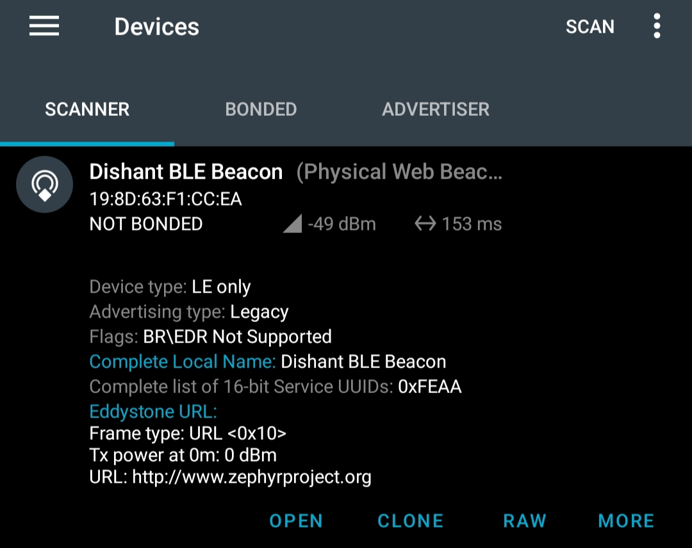

.. _ble_beacon_sample:

Bluetooth Low Energy (BLE) Beacon Sample
========================================

Overview
--------

This sample demonstrates how to implement a simple Bluetooth Low Energy (BLE) beacon
using the Zephyr Real-Time Operating System (RTOS). It initializes the Bluetooth
subsystem and starts non-connectable advertising, broadcasting a device name and
an Eddystone-URL frame.

The beacon advertises with custom advertising data and scan response data. The scan
response includes an encoded URL: ``http://www.zephyrproject.org``.

Key Features
------------

- Bluetooth LE advertising (non-connectable)
- Eddystone-URL frame format support
- Custom advertising and scan response data
- Logging over UART console

Requirements
------------

- A board with Bluetooth LE support (e.g., Nordic nRF52, nRF5340)
- Zephyr configured with Bluetooth support:
  - ``CONFIG_BT=y``
- A BLE scanner app (e.g., nRF Connect for Mobile) to see the advertisement

Building and Running
--------------------

1. Set up your Zephyr development environment (see Zephyr's Getting Started Guide).

2. Choose a compatible board (e.g., ``esp32s3_devkitc``) and build the sample:

   .. code-block:: bash

      west build -b esp32s3_devkit/esp32s3/procpu path/to/sample

3. Flash the firmware to your board:

   .. code-block:: bash

      west flash

4. Open a serial terminal to view logs:

   .. code-block:: bash

      minicom -D /dev/ttyUSB0 -b 115200

   You should see log output similar to:

   .. code-block:: text

        *** Booting Zephyr OS build v4.2.0-2290-g617b71bc174b ***
        [00:00:00.186,000] <inf> Beacon: Starting Beacon Demo
        [00:00:00.186,000] <inf> esp32_bt_adapter: BT controller compile version [4713a69]
        [00:00:00.186,000] <inf> esp32_bt_adapter: Feature Config, ADV:1, BLE_50:1, DTM:1, SCAN:1, CCA:0, SMP:1, CONNECT:1
        [00:00:00.218,000] <inf> bt_hci_core: HCI transport: BT ESP32
        [00:00:00.218,000] <inf> bt_hci_core: Identity: <BLE_ADDRESS> (public)
        [00:00:00.218,000] <inf> bt_hci_core: HCI: version 5.0 (0x09) revision 0x0016, manufacturer 0x02e5
        [00:00:00.218,000] <inf> bt_hci_core: LMP: version 5.0 (0x09) subver 0x0016
        [00:00:00.218,000] <inf> Beacon: Bluetooth initialized !!
        [00:00:00.219,000] <inf> Beacon: Beacon started, advertising as <BLE_ADDRESS> (public)

5. Use a BLE scanner app to view the advertised name and Eddystone URL.

File Structure
--------------

- ``main.c``: Contains the application logic, Bluetooth initialization, and beacon configuration.
- ``CMakeLists.txt``: Build configuration.
- ``prj.conf``: Zephyr configuration options.

Beacon Packet Details
---------------------

- **Advertising Data**:

  - Flags: ``BT_LE_AD_NO_BREDR``
  - Complete Device Name: Configured via ``CONFIG_BT_DEVICE_NAME``

- **Scan Response Data**:

  - UUID: Eddystone (0xFEAA)
  - Frame Type: URL (0x10)
  - Tx Power: Calibrated at 0m (0x00)
  - URL: ``http://www.zephyrproject.org``

Demonstration
-------------

Below is a screenshot of the beacon as seen in a BLE scanner app (e.g., nRF Connect for Mobile):

References
----------
- `Nordic Dev Academy <https://academy.nordicsemi.com/courses/bluetooth-low-energy-fundamentals/lessons/lesson-2-bluetooth-le-advertising/topic/blefund-lesson-2-exercise-1>`_
- `Zephyr Bluetooth Documentation <https://docs.zephyrproject.org/latest/services/bluetooth/index.html>`_
- `Eddystone Specification <https://github.com/google/eddystone>`_
