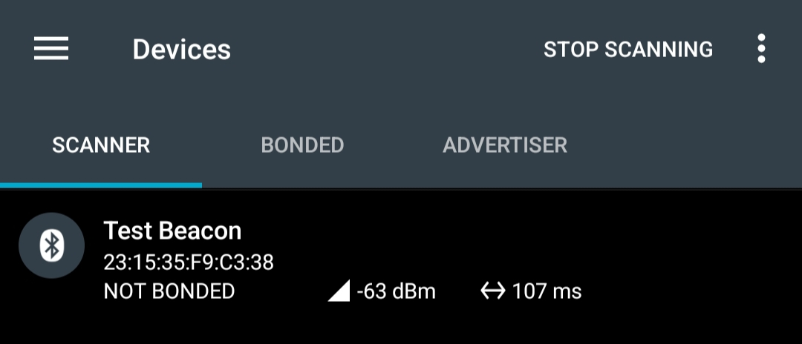
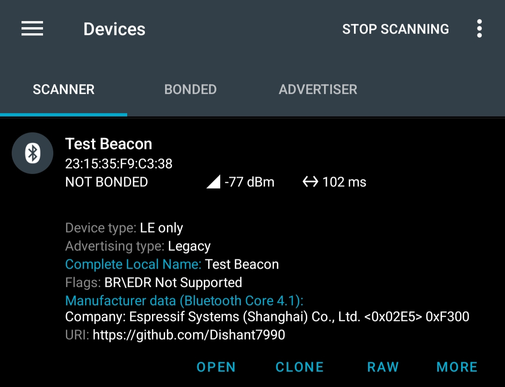
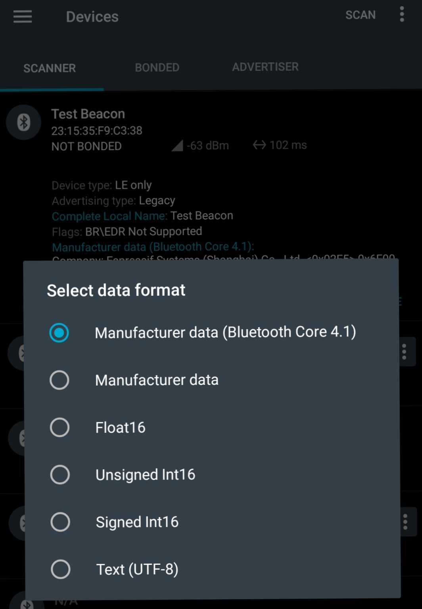
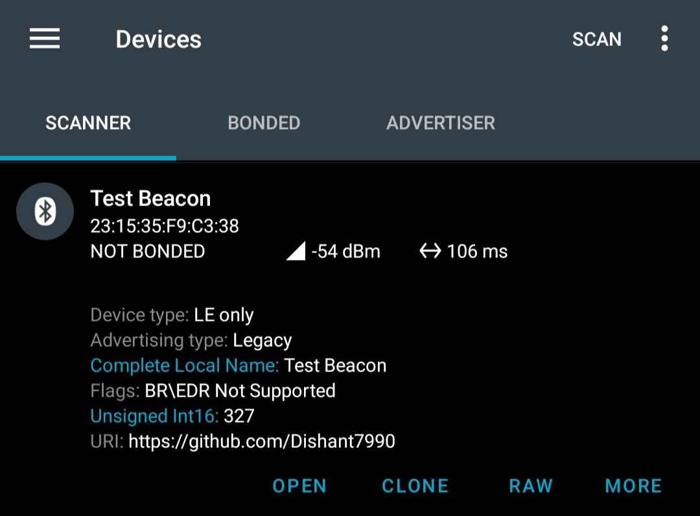
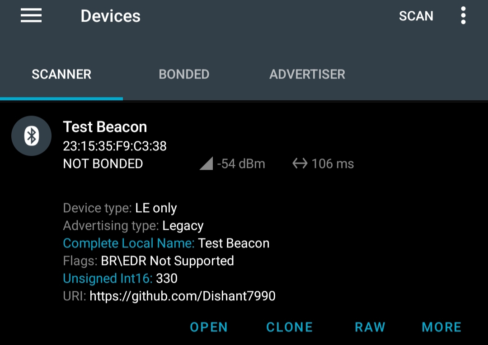

Dynamic BLE Beacon Example
==========================

Overview
--------
This example demonstrates how to create a dynamic Bluetooth Low Energy (BLE) beacon using the Zephyr RTOS on the ESP32-S3 DevKitC board. The beacon advertises manufacturer-specific data that updates periodically, alongside scan response data containing a URL.

Board: **esp32s3_devkitc**

Zephyr Version: **v4.2.0-2290-g617b71bc174b**

Features
--------
- BLE advertising with dynamic manufacturer data.
- Updates advertising data every second.
- Uses standard Bluetooth LE advertising and scan response data.
- Compatible with Bluetooth 5.0 and newer.
- Shows logging output via Zephyr's logging subsystem.

Build & Run Instructions
------------------------
1. Set up your Zephyr environment and export the Zephyr base.
2. Configure your project for the esp32s3_devkitc board.
3. Build the project:

   .. code-block:: sh

      west build -b esp32s3_devkitc/esp32s3/procpu

4. Flash the firmware to the device:

   .. code-block:: sh

      west flash

5. Open a serial console at the appropriate baud rate (usually 115200) to observe logs:

   .. code-block:: sh

      sudo minicom -D /dev/ttyUSB0 -b 115200

Example Logs
------------

.. code-block:: none

  *** Booting Zephyr OS build v4.2.0-2290-g617b71bc174b ***
  [00:00:00.186,000] <inf> Dynamic_Beacon: Dynamically Update the message demo
  [00:00:00.186,000] <inf> esp32_bt_adapter: BT controller compile version [4713a69]
  [00:00:00.186,000] <inf> esp32_bt_adapter: Feature Config, ADV:1, BLE_50:1, DTM:1, SCAN:1, CCA:0, SMP:1, CONNECT:1
  [00:00:00.226,000] <inf> bt_hci_core: HCI transport: BT ESP32
  [00:00:00.227,000] <inf> bt_hci_core: Identity: <BLE_ADDRESS> (public)
  [00:00:00.227,000] <inf> bt_hci_core: HCI: version 5.0 (0x09) revision 0x0016, manufacturer 0x02e5
  [00:00:00.227,000] <inf> bt_hci_core: LMP: version 5.0 (0x09) subver 0x0016
  [00:00:00.227,000] <inf> Dynamic_Beacon: Bluetooth initialized
  [00:00:00.228,000] <inf> Dynamic_Beacon: Beacon started, advertising as <BLE_ADDRESS> (public)
  [00:00:00.228,000] <inf> Dynamic_Beacon: Advertising packet size = 24
  [00:00:00.228,000] <inf> Dynamic_Beacon: Scan responce packet size = 8

Image
-----

In the SCANNER tab, press on the SCAN button to begin scanning

Tap on Nordic_Beacon to view the advertising data.

Changing data to Unsigned int 16

The data will be shown as Unsigned Int 16:

Reference
----------

- `Nordic Dev Academy <https://academy.nordicsemi.com/courses/bluetooth-low-energy-fundamentals/lessons/lesson-2-bluetooth-le-advertising/topic/blefund-lesson-2-exercise-2>`_
- `Zephyr Bluetooth Documentation <https://docs.zephyrproject.org/latest/services/bluetooth/index.html>`_