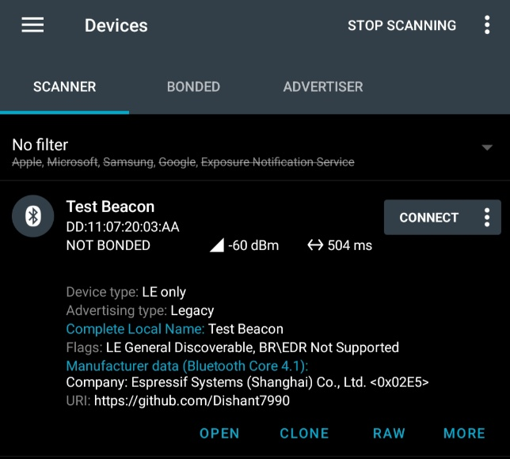

======================================================
BLE Connectable Advertising Demo using Zephyr
======================================================

Overview
--------
This application demonstrates how to configure a BLE peripheral in Zephyr
to perform **connectable advertising** with manufacturer-specific data
and a URI in the scan response.  

The program is based on concepts from the Nordic Developer Academy BLE
course but adapted for **ESP32-S3 DevKitC**. 

Board: **ESP32S3_DevKitC**

Zephyr Version: **v4.2.0-2290-g617b71bc174b** 

Key features:
 - Uses a fixed random static Bluetooth address
 - Configures connectable advertising with ~500 ms interval
 - Advertises:
    * Complete device name
    * Manufacturer-specific company ID
 - Scan Response includes a URI (GitHub profile link)
 - Handles connection and disconnection events
 - Automatically restarts advertising after disconnection
 - Uses Zephyr's ``k_work`` to start advertising asynchronously

Build & Run Instructions
------------------------
1. Set up your Zephyr environment and export the Zephyr base.
2. Configure your project for the esp32s3_devkitc board.
3. Build the project:

   .. code-block:: sh

      west build -b esp32s3_devkitc/esp32s3/procpu

4. Flash the firmware to the device:

   .. code-block:: sh

      west flash

5. Open a serial console at the appropriate baud rate (usually 115200) to observe logs:

   .. code-block:: sh

      sudo minicom -D /dev/ttyUSB0 -b 115200

Example Logs
------------

.. code-block:: none

   *** Booting Zephyr OS build v4.2.0-2290-g617b71bc174b ***
   [00:00:00.186,000] <inf> Connectable_Adv: Connectable Advertising Demo Started
   [00:00:00.187,000] <inf> esp32_bt_adapter: BT controller compile version [4713a69]
   [00:00:00.187,000] <inf> esp32_bt_adapter: Feature Config, ADV:1, BLE_50:1, DTM:1, SCAN:1, CCA:0, SMP:1, CO1
   [00:00:00.222,000] <wrn> bt_hci_core: Num of Controller's ACL packets != ACL bt_conn_tx contexts (12 != 3)
   [00:00:00.222,000] <inf> bt_hci_core: HCI transport: BT ESP32
   [00:00:00.222,000] <inf> bt_hci_core: Identity: DD:11:07:20:03:AA (random)
   [00:00:00.222,000] <inf> bt_hci_core: HCI: version 5.0 (0x09) revision 0x0016, manufacturer 0x02e5
   [00:00:00.222,000] <inf> bt_hci_core: LMP: version 5.0 (0x09) subver 0x0016
   [00:00:00.222,000] <inf> Connectable_Adv: Bluetooth initialized
   [00:00:00.223,000] <inf> Connectable_Adv: Advertising successfully started
   [00:00:00.223,000] <inf> Connectable_Adv: Bluetooth Device name: Test Beacon
   [00:00:03.223,000] <inf> Connectable_Adv: Bluetooth Device name: Test Beacon
   [00:00:06.223,000] <inf> Connectable_Adv: Bluetooth Device name: Test Beacon

Image Demonstration
-------------------
- Scan using **nRF Connect App** on your smartphone

- You should see:
   * Device Name: ``Test Beacon`` (from ``prj.conf``)
   * ``CONNECT`` Option
   * Desired interval ``500 ms``
   * Desired or Static MAC Address ``DD:11:07:20:03:AA``
   * Manufacturer Data: Company ID ``0x02E5`` (Espressif)
   * Scan Response: URI (``https://github.com/Dishant7990``)
- Connect to the device, then disconnect — the device will automatically restart advertising.

Reference
---------
- `Nordic Dev Academy <https://academy.nordicsemi.com/courses/bluetooth-low-energy-fundamentals/lessons/lesson-2-bluetooth-le-advertising/topic/blefund-lesson-2-exercise-3>`_
- `Zephyr Bluetooth Documentation <https://docs.zephyrproject.org/latest/services/bluetooth/index.html>`_
